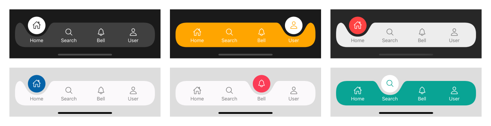

# react-native-fluid-bottom-bar




A beautiful, animated fluid bottom navigation bar for React Native built with **Skia** and **Reanimated**.

It gives you a smooth curved bar, a floating active indicator, and flexible render hooks for fully custom tab designs.

---

## Features

- ✨ Fluid curved bottom bar animation
- 🎯 Floating active indicator
- 🎨 Custom colors and layout constants
- 🧩 Custom render hooks for tab items and floating ball
- 📱 Built for React Native with Skia + Reanimated
- 🚀 Works well for app-style bottom navigation

---

## Installation

Install the library:

```sh
npm install react-native-fluid-bottom-bar
```

or

```sh
yarn add react-native-fluid-bottom-bar
```

If you are using Expo, install peer dependencies with:

```sh
npx expo install react-native-reanimated react-native-gesture-handler @shopify/react-native-skia
```

For a bare React Native app:

```sh
npm install react-native-reanimated react-native-gesture-handler @shopify/react-native-skia
```

> Make sure Reanimated and Skia are configured correctly in your app according to their official installation guides.

---

## Quick Start

```tsx
import React, { useMemo, useState } from 'react';
import { StyleSheet, Text, View } from 'react-native';
import { useSharedValue } from 'react-native-reanimated';
import { FluidBottomBar, type TabItem } from 'react-native-fluid-bottom-bar';

export default function App() {
  const [selectedIndex, setSelectedIndex] = useState(0);
  const activeIndex = useSharedValue(0);

  const handleSelect = (index: number) => {
    setSelectedIndex(index);
    activeIndex.value = index;
  };

  const tabs: TabItem[] = useMemo(
    () => [
      {
        title: 'Home',
        activeIcon: <Text style={styles.activeIcon}>🏠</Text>,
        inactiveIcon: <Text style={styles.inactiveIcon}>🏠</Text>,
        onPress: () => handleSelect(0),
      },
      {
        title: 'Search',
        activeIcon: <Text style={styles.activeIcon}>🔍</Text>,
        inactiveIcon: <Text style={styles.inactiveIcon}>🔍</Text>,
        onPress: () => handleSelect(1),
      },
      {
        title: 'Saved',
        activeIcon: <Text style={styles.activeIcon}>❤️</Text>,
        inactiveIcon: <Text style={styles.inactiveIcon}>🤍</Text>,
        onPress: () => handleSelect(2),
      },
      {
        title: 'Profile',
        activeIcon: <Text style={styles.activeIcon}>👤</Text>,
        inactiveIcon: <Text style={styles.inactiveIcon}>👤</Text>,
        onPress: () => handleSelect(3),
      },
    ],
    []
  );

  return (
    <View style={styles.container}>
      <View style={styles.content}>
        <Text style={styles.title}>Selected: {tabs[selectedIndex]?.title}</Text>
      </View>

      <FluidBottomBar
        tabItems={tabs}
        selectedIndex={selectedIndex}
        setSelectedIndex={handleSelect}
        activeIndex={activeIndex}
      />
    </View>
  );
}

const styles = StyleSheet.create({
  container: {
    flex: 1,
    backgroundColor: '#f8f8f8',
  },
  content: {
    flex: 1,
    justifyContent: 'center',
    alignItems: 'center',
    paddingBottom: 120,
  },
  title: {
    fontSize: 18,
    fontWeight: '600',
  },
  activeIcon: {
    fontSize: 20,
  },
  inactiveIcon: {
    fontSize: 20,
    opacity: 0.6,
  },
});
```

---

## Custom Colors and Layout

```tsx
<FluidBottomBar
  tabItems={tabs}
  selectedIndex={selectedIndex}
  setSelectedIndex={handleSelect}
  activeIndex={activeIndex}
  barColor="#101418"
  floatingBallColor="#7c3aed"
  textColor="#e5e7eb"
  barConstants={{
    CANVAS_HEIGHT: 74,
    CANVAS_BORDER_RADIUS: 28,
  }}
/>
```

---

## Using More Than 4 Tabs

The default `TAB_WIDTH` is tuned for **4 tabs**.

If you want 3, 5, or more tabs, override the sizing values so the active indicator aligns correctly:

```tsx
import { Dimensions } from 'react-native';

const { width } = Dimensions.get('window');
const TAB_COUNT = 5;
const CANVAS_MARGIN = 16;
const CANVAS_PADDING = 16;
const CANVAS_WIDTH = width - CANVAS_MARGIN * 2;

<FluidBottomBar
  tabItems={tabs}
  selectedIndex={selectedIndex}
  setSelectedIndex={handleSelect}
  activeIndex={activeIndex}
  barConstants={{
    CANVAS_MARGIN,
    CANVAS_PADDING,
    CANVAS_WIDTH,
    TAB_WIDTH: (CANVAS_WIDTH - CANVAS_PADDING * 2) / TAB_COUNT,
  }}
/>;
```

---

## Custom Tab Rendering

Use `renderTabItem` when you want to fully control how each tab looks:

```tsx
import { Pressable, Text, View } from 'react-native';

<FluidBottomBar
  tabItems={tabs}
  selectedIndex={selectedIndex}
  setSelectedIndex={handleSelect}
  activeIndex={activeIndex}
  renderTabItem={({ tabItem, isSelected }) => (
    <Pressable
      onPress={tabItem.onPress}
      style={{
        flex: 1,
        alignItems: 'center',
        justifyContent: 'center',
        gap: 4,
      }}
    >
      <View>{isSelected ? tabItem.activeIcon : tabItem.inactiveIcon}</View>
      <Text
        style={{
          color: isSelected ? '#111827' : '#6b7280',
          fontWeight: isSelected ? '700' : '500',
        }}
      >
        {tabItem.title}
      </Text>
    </Pressable>
  )}
/>;
```

---

## API Reference

### FluidBottomBar Props

| Prop                      | Type                                             | Required | Default        | Description                                                                                                  |
| ------------------------- | ------------------------------------------------ | -------- | -------------- | ------------------------------------------------------------------------------------------------------------ |
| `tabItems`                | `TabItem[]`                                      | Yes      | –              | List of tabs to render.                                                                                      |
| `selectedIndex`           | `number`                                         | Yes      | –              | Currently selected tab index.                                                                                |
| `setSelectedIndex`        | `(index: number) => void`                        | Yes      | –              | Controlled state setter for the selected tab.                                                                |
| `activeIndex`             | `SharedValue<number>`                            | Yes      | –              | Animated shared value used for the floating ball and curve movement. Keep this in sync with `selectedIndex`. |
| `barColor`                | `ColorValue`                                     | No       | `#EDEDED`      | Background color of the bar shape.                                                                           |
| `floatingBallColor`       | `ColorValue`                                     | No       | `#FF4242`      | Color of the default floating indicator.                                                                     |
| `textColor`               | `ColorValue`                                     | No       | `#7b7b7b`      | Label color for the default tab item renderer.                                                               |
| `barConstants`            | `Partial<BarConstantsType>`                      | No       | `BarConstants` | Override layout and animation sizing values.                                                                 |
| `renderFloatingBallLayer` | `(props: FloatingBallProps) => React.ReactNode`  | No       | `undefined`    | Replaces the entire floating-ball layer.                                                                     |
| `renderFloatingBall`      | `(props: FloatingBallProps) => React.ReactNode`  | No       | `undefined`    | Replaces only the default floating ball UI. You handle the custom animation/rendering.                       |
| `renderInteractiveLayer`  | `() => React.ReactNode`                          | No       | `undefined`    | Replaces the full tab interaction layer.                                                                     |
| `renderTabItem`           | `(props: BottomTabItemProps) => React.ReactNode` | No       | `undefined`    | Custom renderer for each tab item.                                                                           |

### TabItem

| Field          | Type         | Required | Description                              |
| -------------- | ------------ | -------- | ---------------------------------------- |
| `title`        | `string`     | Yes      | Tab label text.                          |
| `onPress`      | `() => void` | Yes      | Action to run when the tab is pressed.   |
| `activeIcon`   | `ReactNode`  | Yes      | Icon shown when the tab is selected.     |
| `inactiveIcon` | `ReactNode`  | Yes      | Icon shown when the tab is not selected. |

### FloatingBallProps

| Field                | Type                                            | Description                                                               |
| -------------------- | ----------------------------------------------- | ------------------------------------------------------------------------- |
| `activeIndex`        | `SharedValue<number>`                           | Animated index value for custom floating-ball movement.                   |
| `floatingBallColor`  | `ColorValue`                                    | Color passed to your custom floating-ball renderer.                       |
| `barConstants`       | `Partial<BarConstantsType>`                     | Current bar sizing configuration.                                         |
| `renderFloatingBall` | `(props: FloatingBallProps) => React.ReactNode` | Optional nested render function used internally by the default component. |

### BottomTabItemProps

| Field          | Type                                                                                        | Description                                                           |
| -------------- | ------------------------------------------------------------------------------------------- | --------------------------------------------------------------------- |
| `tabItem`      | `TabItem`                                                                                   | The current tab configuration.                                        |
| `index`        | `number`                                                                                    | Tab position in the list.                                             |
| `activeIndex`  | `SharedValue<number>`                                                                       | Shared animated index.                                                |
| `isSelected`   | `boolean`                                                                                   | Whether the tab is currently active.                                  |
| `textColor`    | `ColorValue`                                                                                | Label color for the default renderer.                                 |
| `barConstants` | `Partial<BarConstantsType>`                                                                 | Layout overrides.                                                     |
| `renderLabel`  | `(props: { isSelected: boolean; textColor: ColorValue; title: string }) => React.ReactNode` | Custom label renderer when building your own tab item implementation. |

### BarConstantsType

| Key                    | Default                                   | Description                                                  |
| ---------------------- | ----------------------------------------- | ------------------------------------------------------------ |
| `SPRING`               | `undefined`                               | Uses Reanimated's default spring behavior unless overridden. |
| `CANVAS_WIDTH`         | `windowWidth - 32`                        | Total width of the bar canvas.                               |
| `CANVAS_MARGIN`        | `16`                                      | Horizontal spacing from screen edges.                        |
| `CANVAS_PADDING`       | `16`                                      | Inner horizontal padding for the interactive content.        |
| `CANVAS_HEIGHT`        | `70`                                      | Height of the bar.                                           |
| `CANVAS_BORDER_RADIUS` | `32`                                      | Corner radius of the bar shape.                              |
| `TAB_WIDTH`            | `(CANVAS_WIDTH - 2 * CANVAS_PADDING) / 4` | Width allocated to each tab by default.                      |

---

## Tips

- Keep `selectedIndex` and `activeIndex.value` synchronized.
- The bar is positioned absolutely near the bottom of the screen, so leave enough bottom space in your layout.
- For the best alignment, update `TAB_WIDTH` whenever your tab count changes.
- If you provide `renderFloatingBall`, you are responsible for rendering and animating the custom indicator.

---

## Contributing

- [Development workflow](CONTRIBUTING.md#development-workflow)
- [Sending a pull request](CONTRIBUTING.md#sending-a-pull-request)
- [Code of conduct](CODE_OF_CONDUCT.md)

## License

MIT
